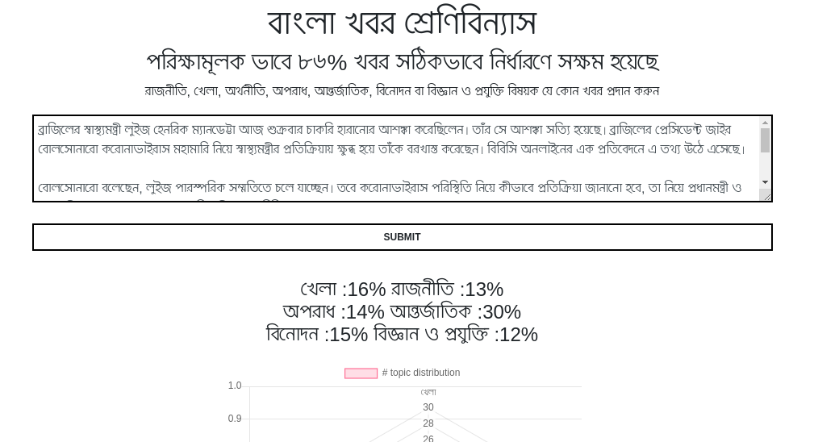
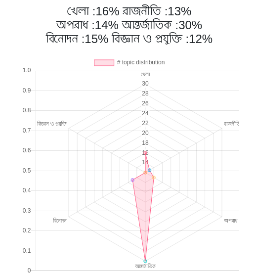

# Topic-Modeling-in-Bengali

Visit the link(https://aljubaer.github.io/Topic-Modeling-in-Bengali/). App is hosted here.

To run the project, follow the commands. Here you must have Node Js, Python3 and Flask installed.

First clone the project 

`git clone https://github.com/aljubaer/Topic-Modeling-in-Bengali.git` 

Go to the `gui` folder 

`cd gui` 

Install the dependencies 

`pip3 install gensim`
`npm install` 

Finally run this two command in two seperate terminals

`python3 server.py`

`npm start`

### Some sample screenshots

